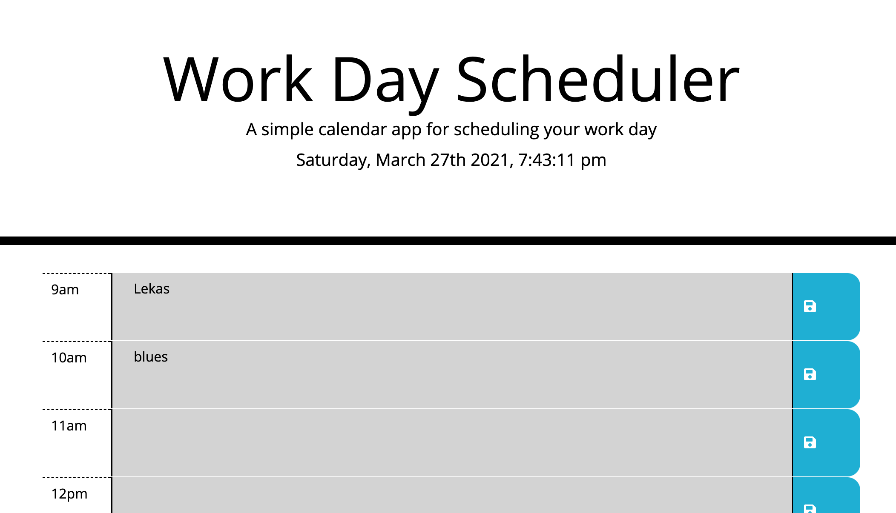

# jq-work-scheduler
Simple calendar application to keep track of work day tasks

This app uses:
- Moment library to format the dates and times
- Javascript for DOM manipulation 

Work Date Schedule Functionality is as follows:

it uses colors to identify past, present and future hours of the day
- green color marks future time slots of the day
- gray color marks the past time slots
- red color marks the current hour

it displays and keeps description for each time slot
- click on the middle section of the time slot to type the task(s) for the hour
- click on save icon on the right to save your tasks fro the time slot
- store the time slot data to the localstorage

The following image demonstrates the web application's appearance:

To view the working app use the link below:

https://elmir123.github.io/jq-work-scheduler/.

